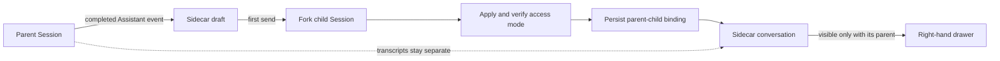

# dsh-sidecar-conversation

[](https://github.com/gosomea/dsh-sidecar-conversation/actions/workflows/ci.yml)
[](./LICENSE)
[](./package.json)

Conversation-bound side chats for [DeepSeek Harness](https://github.com/deepseek-ai/deepseek-harness) Web.

Select text in a completed Assistant message—or ask about the whole turn—and continue in a persistent conversation beside the main chat. Each Sidecar is bound to its parent Session, keeps the parent conversation unchanged, and disappears when you switch to an unrelated Session.

> Status: early release (`0.1.0`). The plugin targets DeepSeek Harness SDK `0.1.0-rc.6` and the Web profile.

[简体中文](./README.zh.md) · [Architecture](./docs/architecture.md) · [Compatibility](./docs/compatibility.md) · [Development](./docs/development.md)

## Why Sidecar?

A normal branch is useful when you want to leave the current line of work. A Sidecar is for questions that should inherit context without taking over the main conversation:

- explain one paragraph without interrupting the primary task;
- investigate an alternative implementation in parallel;
- inspect a completed turn from another angle;
- keep several focused follow-ups attached to one parent Session.

The parent transcript and Sidecar transcript stay separate. Closing the drawer does not cancel work already running in the Sidecar.

## Features

- **Selection-aware entry** — selecting finalized Assistant text reveals an in-place **Ask in side chat** action.
- **Whole-turn entry** — every completed Assistant turn has an **Ask about this turn** action.
- **Parent-bound visibility** — Sidecars appear only while their parent Session is active.
- **Explicit access mode** — every new Sidecar shows **Read-only** and **Inherit** before its first send.
- **No implicit reuse** — a parent-originated question prepares a new Sidecar; continuing the active Sidecar is an explicit choice.
- **Native conversation behavior** — Markdown, code blocks, reasoning and tool folds, cancellation, approvals, and structured questions render inside the drawer.
- **Reliable streaming** — SSE is established before history is loaded, then events are merged and de-duplicated by sequence and RPC ID.
- **Background continuity** — switching Sessions or closing the drawer releases visible subscriptions without stopping generation.
- **Layout coexistence** — the plugin stays inside the Harness conversation column and does not replace AionUI details, preview, or explorer panels.
- **Crash-safe registry** — parent/child bindings are persisted atomically with `0600` permissions and recoverable provisioning state.

## Quick start

Requirements:

- Node.js 22 or newer
- pnpm 11.7.0
- a working DeepSeek Harness Web profile

```bash
git clone https://github.com/gosomea/dsh-sidecar-conversation.git
cd dsh-sidecar-conversation

corepack enable
corepack prepare pnpm@11.7.0 --activate
pnpm install --frozen-lockfile
pnpm check
pnpm test
pnpm build

dsh plugin --profile web add link:$(pwd)
dsh web
```

Restart `dsh web` after rebuilding or updating the linked plugin.

The plugin is installed through the repository-root [`cordis.patch.yml`](./cordis.patch.yml). It does not require changes to the DeepSeek Harness checkout or to `profiles/web/cordis.patch.yml`.

## Usage

### Ask about selected text

1. Select up to 4,000 characters inside a completed Assistant message.
2. Click **Ask in side chat** in the contextual action.
3. Choose **Read-only** or **Inherit** in the right-hand drawer.
4. Enter a question and send it.

The selection is verified on the Host against the finalized Assistant message ID and sequence before the child Session is created.

### Ask about a complete turn

1. Click **Ask about this turn** beside the completed turn actions.
2. Choose the access mode.
3. Send the first question.

The child Session forks from that completed Assistant event and inherits the conversation history as model context. The drawer renders only the post-fork Sidecar exchange.

### Continue or create another Sidecar

Opening a new question from the parent prepares a new independent Sidecar by default and displays the access-mode selector. If the parent already has an active Sidecar, choose **Continue current Sidecar** to append the validated selection or turn context there instead.

Each new Sidecar becomes a separate child Session. Tabs in the drawer switch among the current parent Session's Sidecars; they never cross parent boundaries.

## Access modes

| Mode | Effective policy | Intended use |
| --- | --- | --- |
| **Read-only** (default) | `sandbox=read-only`, `approval=never` | Analyze, search, inspect files, and discuss code without modifying the workspace. |
| **Inherit** | Permission state captured at the fork point | Continue with the same workspace capabilities the parent had when the Sidecar was created. |

The access mode is immutable after creation. Create another Sidecar to use a different mode.

Read-only is enforced by durable Session policy events before the first prompt. The Host verifies the effective policy and installs a fail-closed tool guard: if the policy drifts, tool execution is denied. Text such as `/permission danger-full-access` entered in the Sidecar is wrapped as user data rather than executed as a hidden Session command.

### Security boundary

Read-only means **workspace filesystem read-only**. It does not claim to:

- disable network reads;
- classify side effects of arbitrary third-party MCP tools or external APIs;
- isolate the parent and child into different operating-system workspaces.

Inherit mode can modify the shared workspace. Parent and Sidecar Sessions may race when they edit the same files concurrently.

## Session model



Important invariants:

1. `parentSessionId` is immutable.
2. A child ID is accepted by Sidecar APIs only when it exists in the Registry.
3. Source text is verified against a finalized Assistant event before forking or appending context.
4. Create and prompt retries derive stable RPC IDs and do not duplicate forks or questions.
5. The main Session remains selected; implementation child Sessions are hidden from primary navigation.

See [docs/architecture.md](./docs/architecture.md) for the complete lifecycle and recovery model.

## Layout and plugin compatibility

The client registers an additive `shell.overlay` contribution. It locates the current chat center through `[data-conversation-scroll]`, observes its geometry, and reserves a lane inside that region only while the Sidecar is visible.

It does not change `grid-template-columns` and does not depend on private AionUI class names. When `dsh-aionui-panel` is installed, its details, preview, and explorer columns remain owned by AionUI while the Sidecar shares only the conversation center.

The drawer is resizable from 400–720 px. On narrow conversation centers it switches to a full-center overlay.

## Data and HTTP surface

| Item | Location |
| --- | --- |
| Cordis patch | `cordis.patch.yml` |
| Host Registry | `$DSH_HOME/sidecar-conversation.json` |
| Browser UI state | `dsh.sidecar-conversation.ui.v1` |
| HTTP API | `/sidecar-conversation/v1/*` |

The HTTP routes accept loopback, same-origin requests only, limit JSON request bodies, and reject unregistered child Sessions.

Registry v2 uses a sibling temporary file, `fsync`, atomic rename, and `0600` permissions. A malformed Registry is preserved byte-for-byte and becomes read-only instead of being overwritten. V1 records migrate to **Inherit** to preserve their previous behavior.

## Development

```bash
pnpm install --frozen-lockfile
pnpm check
pnpm test
pnpm build
pnpm pack --dry-run
```

The repository is standalone:

- no outer workspace configuration;
- no local TypeScript `paths` or shared `extends`;
- no `workspace:` or local `link:` package dependency;
- published `@deepseek-ai/*` SDK packages only;
- Node.js 22 CI with a pinned pnpm version.

Tests cover Registry migration and corruption handling, immutable parent binding, permission pinning and drift failure, idempotent create/prompt operations, selection validation, history/SSE merging, parent-scoped UI state, and layout cleanup.

## Current limitations

- Text prompts only; no image or file attachments.
- No automatic write-back from a Sidecar into its parent conversation.
- Access mode cannot be changed after creation.
- Workspace isolation is outside this plugin's scope.

## Contributing

Issues and pull requests are welcome. For behavior changes, add or update tests and run the full development command set before opening a pull request.

## License

[Apache License 2.0](./LICENSE)
